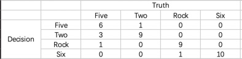

<h1>Homework 2 - Hand Gesture Recognization</h1>

 
 CS 585 HW 2  
 Deyan Hao  
 Yirong Zhang  
 2021/2/17

<h2> Description </h2>

In this project, we use OpenCV to develop algorithms that recognize different hand shapes from the input stream of image frames and then created graphical display according to our algorithm decision. We used skin detection, frame-to-frame differecing, background differencing, bounding box detection and template matching to classify the correct hand shape and display its corresponding name as text. We chose one, rock, five and six as our template hand shape. Some anticipated difficulties are differentiating hand from background and matching the hand shape or gesture with the correct template in various angle and size.

<h2> Method and Implementation </h2>

We first got the current image from webcamera. In order to distinguish the  hand from the background, we modified the skin dection function based on the code from previous labs by a method which explicitly defines a range of color through the difference between RBG values (Peer et al. 2003). The function returns a new binary image with skin colored as white and everything else as black. 

 With the binary image, we used a built-in function in cv2, findContours, to define the biggest object in the current scene.The function cv2.findContours requires three parameters: a source image, mode and method which are discussed in lab. The function would return an array of array containing all the contours and hierarchy. The array of contour is used to find the largest object of the image.

Before we started matching, another built-in function, pryDown, was used to generate different sizes of the source images in order to find the best match. The function only has one necessary parameter which is the source image. The function would resize the input image by halfing the number of columns and rows in the image. Size can also be inputed as parameter if particular size was wanted. We computed 3 additional source images for the template matching.

We chose to a built-in function, matchTemplate for our template matching because it contained many similarity functions including the ones we discussed in class. The function match Template has three parameters: the source image, the template image and the matching method. We compared the result of Sum-Squared Difference(SDD) and Normalized Correlation(NCC) and used NCC as would template matching function because of its better result in our situation. The formular for NCC is: 
<td>  </td> 

r is the normalized correlation coefficient which would range in 1 and -1. For NCC, the higher normalized correlation coefficient presents better matching, while for SDD, the lowest coeddificient is the best matching. s_i and m_i are the brightness value for source image and template image. In addition, the source image has to be bigger than the template images. The function would return a array of normalized correlation coefficient. All templates were compared with the source image. Since we usde NCC as the macthing method, the highest coefficient value would be the best match. We set a threshold (r = 0.85) to eliminate inaccurate macthing. The matched portion would also be bounded by a red bounding box through method cv2.rectangle which was introduced in previous labs.

Once the gesture was detected, the decision would be displayed in the window through a OpenCV function putText, which has the targeted image, text, the coordinates for the text,font and size of font as parameters. It would simply display the text to specific position in the image. If the coefficient was lower than the threshold, then we displayed "not sure" on the window. Background differencing and motion history which were also from previous labs were applied to the webcamera image to detect movements of the gesture. If four of the history image showed past movement, the window would display "moving" to indicate the movement. 

<h2>Experiments</h2>

We collected 40 samples from our program by showing each gesture 10 times in random order and computed a confusion matrix. 

 Our templates are binary images:
	 
	
	
	

 possible outputs:

	
	
	
	

<h2> Result</h2>

 Video demo

https://user-images.githubusercontent.com/35748207/128778743-280294c3-c9e1-4bd9-ad8e-203e9cf3ef76.mov

Confusion matrix 

<td>  </td> 

<h2> Discussion </h2>

 
Sensitivity:  Five -> 0.85   Two -> 0.75   Rock -> 0.90   One -> 0.91

Specificity:  Five -> 0.97   Two -> 0.90   Rock -> 0.97   One -> 0.97

We can see from the confusion matrix that two and five are easily get misclassified, rock and six are likely to be mixed as well. Experiments for six has very good result. According to the stats above, both sensitivity and specificity are high whcih means the program is relatively accurate. On the other hand, this program can be easily affected by the background environment and the distance between the webcam and the hand. Background with noise would largely reduce the performance of our program. If the hand is closer or further away from the camera, the result will also be affected.

</ul>

<h2> Conclusions </h2>

In conclusion, the algorithm can successfully detect different gestures when the backgroumnd is relatively clean. When the background has additional noise or the distance between hand and webcamera is changed, the result would be less accurate.  

